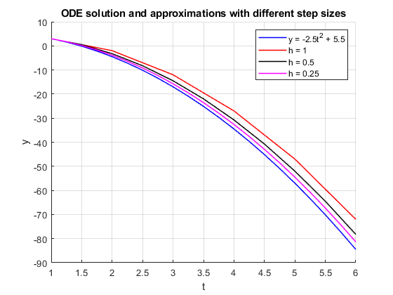
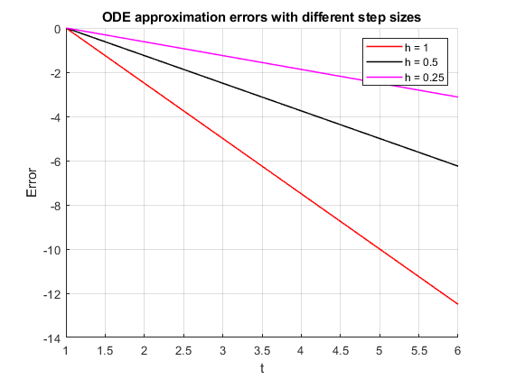

# Euler method
___
## Overview
The Euler method is a numerical technique for solving ordinary differential equations (ODEs). It was originally published by Leonard Euler in 1786. 

Beacuse of it's simplicity it is often used as an introductory method to numerical integration. It relies on using integral approximation and derivation value at step $k$ to calculate new integral approximation at step $k+1$. 

## Derivation
Let's consider the ordinary differential equation in the following form:

$\frac{dy}{dx} = f(x,y)$, 

with inital condition $y(x_0) = y_0$

Now let's take a look at Taylor series expansion:

$f(x) = f(a) + f'(a)(x-a) + \frac{(''(a)}{2!}(x-a)^2 + \frac{f^{(3)}(a)}{3!}(x-a)^3 + ... + \frac{f^{(n)}(a)}{n!}(x-a)^n + ...$

If we ignore quadratic and higher terms we get

$f(x) = f(a) + f'(a)(x-a)$ .

Let's assume $h = x - a$ and $x > a$. We call $h$ step size. If we substitute in the equation above we get

$f(x) = f(x - h) + f'(x - h) \cdot h$ .

Value of the function $f(x_k)$ is calculated from value of $f(x_{k-1})$, first derivative of the $f(x)$ at $x_{k-1}$ and step size $h = {x_k - x_{k-1}}$.

Using this equation we can numerically solve (some) ordinary differential equations. Let's go overs a few examples.

To learn more about Taylor series see [Wikipedia](https://en.wikipedia.org/wiki/Taylor_series) article or [this](https://www.youtube.com/watch?v=3d6DsjIBzJ4) video by 3Brown1Blue
## Examples

### Example 1

Let's consider a following differential equation:

$\frac{dy}{dt} = -5.0 \cdot t$, 

$y(1.0) = 3.0$.

We are going to use the Euler method equation derived above using different step sizes to demonstrate and get the intuition on the effect of step size to calculation accuracy.

Let's calculate $y(6.0)$ using steps $h_1=1.0, h_2=0.5$ and $h_3 = 0.25$.

We need to perform $(x_{final} - x_{inital}) / h$ calculations to get to the result from initial conditions. That means in the first case we will perform $N_{steps}=(6.0 - 1.0)/1 = 5$, in the second $N_{steps}=(6.0 - 1.0)/0.5 = 10$ and in the third $N_{steps}=(6.0 - 1.0)/0.25 = 20$ steps.

Because first case requires the least number of steps, let's show them written out in detail:

$y(1.00) = 3.00$ $\rightarrow$ this is our intial condition

$y(2.00) = y(1.00) + h \cdot y'(1.00) = 3.00 + 1.00 \cdot (-5.0) \cdot 1.00 = -2.00$

$y(3.00) = y(2.00) + h \cdot y'(2.00) = -2.00 + 1.00 \cdot (-5.0) \cdot 2.00 = -12.00$

$y(4.00) = y(3.00) + h \cdot y'(3.00) = -12.00 + 1.00 \cdot (-5.0) \cdot 3.00 = -27.00$

$y(5.00) = y(4.00) + h \cdot y'(4.00) = -27.00 + 1.00 \cdot (-5.0) \cdot 4.00 = -47.00$

$y(6.00) = y(5.00) + h \cdot y'(5.00) = -47.00 + 1.00 \cdot (-5.0) \cdot 5.00 = -72.00$

See Figures 1. & 2. below and notice how when smaller step size is used, approximation error is reduced.

  

  Figure 1. ODE approximations with different step sizes

 

  

  Figure 2. ODE approximation errors with different step sizes

